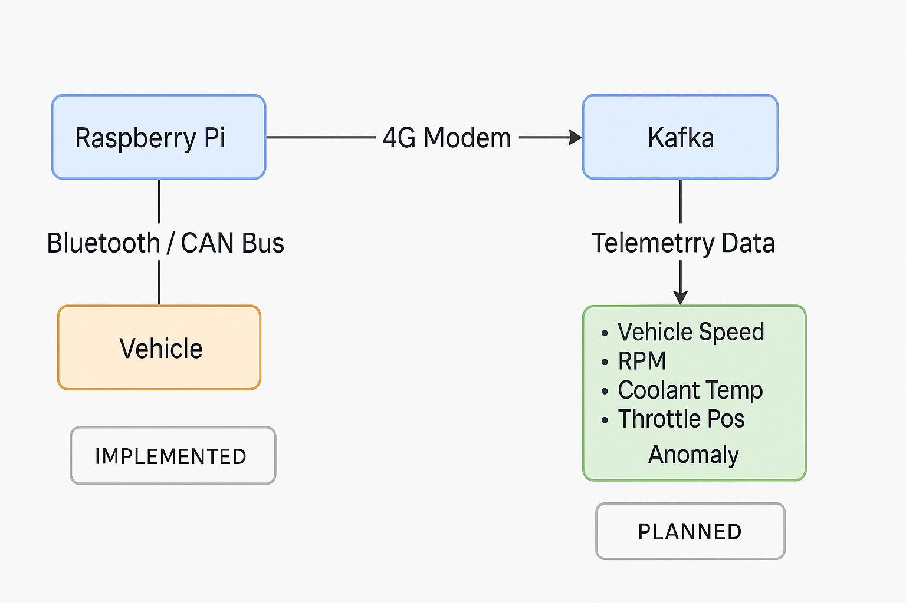

# 🚗 Vehicle Telemetry Console using Raspberry Pi, ELM327 & Bluetooth

This project demonstrates how to read real-time vehicle telemetry like **speed** and **RPM** from a car’s **OBD-II port** using an **ELM327 Bluetooth module** and display it on a custom-built **instrument console on Raspberry Pi**.

> ✅ Originally built in 2019 as a hobby project  
> 📈 Planned extension: stream data to Kafka for real-time anomaly detection using ML models

---

## 📽️ Demo Video

👉 **[Watch the demo here](#)**  
_(Replace `#` with your YouTube or Vimeo link)_

---

## 📦 Project Structure

- `obd_bt.py` – Main script to interface with ELM327 over Bluetooth  
- `instrument_console.py` – Displays real-time speed/RPM on Pi screen  
- `elm_commands.txt` – Reference for OBD-II commands used

---

## 🛠️ Technologies Used

- Raspberry Pi (Python 3)  
- ELM327 OBD-II Bluetooth module  
- Bluetooth serial communication  
- Custom instrument UI using Python  
- 🔜 Apache Kafka (planned)  
- 🔜 Real-time anomaly detection via Spark ML (planned)

---

## 🔧 Hardware Setup

1. Raspberry Pi (any model with Bluetooth)  
2. ELM327 Bluetooth module  
3. Vehicle with OBD-II port  
4. Power supply + screen (HDMI or TFT display)

---

## 🧭 System Architecture

### ✅ Implemented

- Raspberry Pi reads OBD data via ELM327 over Bluetooth  
- Vehicle parameters (Speed, RPM) displayed as instrument console

### 🔜 Planned

- Kafka producer to stream telemetry  
- Kafka + Spark for real-time anomaly detection  
- Use ML to predict faults or abnormal vehicle behavior

---

## 📌 Roadmap

- [x] Fetch RPM and speed from OBD  
- [x] Build visual dashboard on Pi  
- [ ] Stream data to Kafka  
- [ ] Train anomaly detection model  
- [ ] Deploy model for real-time detection

---

## 🤖 Future Applications

- Predictive vehicle maintenance  
- Fleet management insights  
- Driver behavior analytics

---

## 📂 Repository

GitHub: [spsarolkar/Tesla](https://github.com/spsarolkar/Tesla/tree/master)
